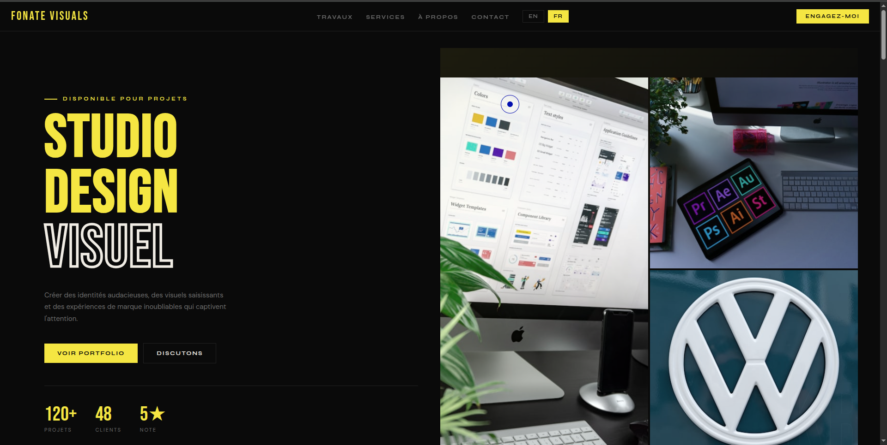
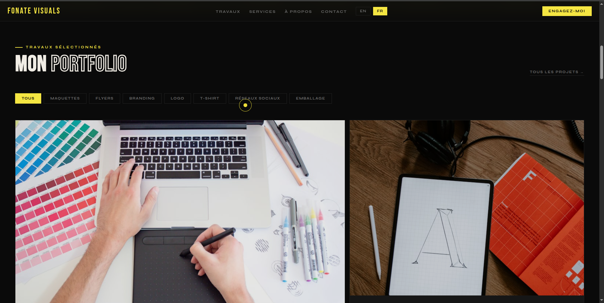

# FONATE VISUALS - Design Portfolio

A modern, responsive portfolio website showcasing design services including mockups, branding, logos, flyers, and social media content. Built with clean HTML, CSS, and JavaScript with full bilingual support (English/French).



## 🎨 Features

### ✨ Core Features
- **Bilingual Support** - Full English and French translations with language switcher
- **Custom Cursor** - Animated cursor with ring effect for desktop
- **Responsive Design** - Fully responsive with mobile-optimized carousels
- **Portfolio Showcase** - Filterable portfolio grid with category filters
- **Branding Showcase Page** - Dedicated page displaying complete branding packages
- **Smooth Animations** - Scroll-triggered reveal animations and smooth transitions
- **Contact Integration** - WhatsApp and Instagram direct links

### 📱 Responsive Features
- **Desktop**: Grid layouts with hover effects
- **Tablet**: Optimized 2-column layouts
- **Mobile**: Touch-enabled carousels with swipe support

### 🎯 Sections
1. **Hero Section** - Eye-catching introduction with stats
2. **Marquee** - Animated service ticker
3. **Portfolio** - Filterable project showcase (8 categories)
4. **Services** - 6 design services with icons
5. **About** - Designer profile and skills
6. **Testimonials** - Client reviews
7. **Contact** - Email, WhatsApp, and social links



## 🚀 Quick Start

### Prerequisites
- Modern web browser (Chrome, Firefox, Safari, Edge)
- Local web server (optional, for development)

### Installation

1. **Clone or Download** the repository
```bash
git clone <repository-url>
cd fonate-visuals
```

2. **Open in Browser**
   - Simply open `index.html` in your browser
   - Or use a local server:
   ```bash
   # Using Python
   python -m http.server 8000
   
   # Using Node.js
   npx serve
   ```

3. **Access the Website**
   - Main page: `http://localhost:8000/index.html`
   - Branding showcase: `http://localhost:8000/branding-showcase.html`

## 📁 Project Structure

```
fonate-visuals/
├── index.html                 # Main portfolio page
├── branding-showcase.html     # Detailed branding showcase
├── styles.css                 # All styles and responsive design
├── script.js                  # Main JavaScript functionality
├── lang-en.json              # English translations
├── lang-fr.json              # French translations
├── Images/                   # Image assets
│   └── docs-image/          # Documentation images
└── README.md                # This file
```

## 🎨 Customization

### Update Personal Information

#### 1. Contact Details
Edit in `index.html` and `branding-showcase.html`:
```html
<!-- Email -->
<a href="mailto:developerfonate@gmail.com">developerfonate@gmail.com</a>

<!-- WhatsApp -->
<a href="https://wa.me/237621793565">+237 621 793 565</a>

<!-- Instagram -->
<a href="https://www.instagram.com/developerfonate">@developerfonate</a>
```

#### 2. Brand Name
Replace "FONATE VISUALS" in:
- `index.html` (loader, nav, footer)
- `branding-showcase.html` (nav, footer)

#### 3. Footer
Update in both HTML files:
```html
<div class="footer-text">Made by Fonate Michael</div>
```

### Modify Colors

Edit CSS variables in `styles.css`:
```css
:root {
  --bg: #0a0a0a;           /* Background */
  --surface: #111111;       /* Surface color */
  --card: #161616;          /* Card background */
  --accent: #f5e642;        /* Accent color (yellow) */
  --text: #f0ece4;          /* Text color */
  --muted: #6b6b6b;         /* Muted text */
  --border: #222;           /* Border color */
  --nav-h: 64px;            /* Navigation height */
}
```

### Add Portfolio Items

Edit the `portData` array in `script.js`:
```javascript
const portData = [
  {
    cat: 'mockup',                    // Category
    meta: 'Mockup',                   // Badge text
    img: 'image-url.jpg',             // Image URL
    catLabel: 'Product Mockup',       // Category label
    name: 'PROJECT NAME'              // Project name
  },
  // Add more items...
];
```

**Available Categories:**
- `mockup` - Product mockups
- `logo` - Logo designs
- `flyer` - Event flyers
- `branding` - Brand identity
- `tshirt` - T-shirt mockups
- `social` - Social media content
- `packaging` - Packaging design

### Update Services

Edit the services section in `index.html`:
```html
<div class="service-card reveal">
  <div class="service-num">01</div>
  <div class="service-icon"><i class="fa-solid fa-image"></i></div>
  <div class="service-title" data-i18n="services.service1.title">Service Name</div>
  <div class="service-desc" data-i18n="services.service1.description">Description</div>
  <div class="service-tags">
    <span class="service-tag">Tag1</span>
    <span class="service-tag">Tag2</span>
  </div>
</div>
```

### Add Translations

Update `lang-en.json` and `lang-fr.json`:
```json
{
  "nav": {
    "work": "Work",
    "services": "Services"
  },
  "hero": {
    "title1": "VISUAL",
    "description": "Your description here"
  }
}
```

## 🌐 Translation System

### How It Works
1. Language preference is saved in `localStorage`
2. Translations load from JSON files (`lang-en.json`, `lang-fr.json`)
3. Elements with `data-i18n` attributes update automatically
4. Language switcher syncs across all pages

### Add New Translatable Content
```html
<!-- HTML -->
<h2 data-i18n="section.title">Default Text</h2>

<!-- JSON (lang-en.json) -->
{
  "section": {
    "title": "English Title"
  }
}

<!-- JSON (lang-fr.json) -->
{
  "section": {
    "title": "Titre Français"
  }
}
```

## 📱 Responsive Breakpoints

```css
/* Desktop: Default styles */

/* Tablet: ≤1100px */
@media(max-width:1100px) {
  /* 2-column layouts */
}

/* Mobile: ≤768px */
@media(max-width:768px) {
  /* Single column, carousels enabled */
}

/* Small Mobile: ≤380px */
@media(max-width:380px) {
  /* Reduced font sizes */
}
```

## 🎯 Key Components

### Custom Cursor
```javascript
// Cursor follows mouse with smooth animation
// Ring has elastic easing effect
// Expands on hover over interactive elements
```

### Portfolio Filter
```javascript
// Filter by category: all, mockup, logo, flyer, etc.
// Smooth fade-in animation for filtered items
// Syncs with mobile carousel
```

### Carousels (Mobile)
```javascript
// Touch swipe support
// Dot navigation
// Arrow controls
// Auto-initializes on resize
```

### Reveal Animations
```javascript
// IntersectionObserver triggers animations
// Staggered delays for sequential reveals
// Smooth fade-in with translateY
```

## 🔧 Browser Support

- ✅ Chrome (latest)
- ✅ Firefox (latest)
- ✅ Safari (latest)
- ✅ Edge (latest)
- ✅ Mobile browsers (iOS Safari, Chrome Mobile)

## 📦 Dependencies

### External Libraries
- **Font Awesome 6.5.1** - Icons
- **Google Fonts** - Bebas Neue, Syne, DM Sans

### No Build Tools Required
- Pure HTML, CSS, JavaScript
- No npm, webpack, or bundlers needed
- Works directly in browser

## 🎨 Design Features

### Typography
- **Headings**: Bebas Neue (bold, uppercase)
- **UI Elements**: Syne (clean, modern)
- **Body Text**: DM Sans (readable, elegant)

### Color Scheme
- **Dark Theme**: Professional and modern
- **Accent Yellow**: High contrast, attention-grabbing
- **Subtle Grays**: Hierarchy and depth

### Animations
- **Smooth Transitions**: 0.3-0.7s cubic-bezier easing
- **Hover Effects**: Scale, translate, color changes
- **Scroll Reveals**: Fade-in with upward motion
- **Marquee**: Infinite scroll animation

## 📞 Contact Integration

### WhatsApp
```html
<a href="https://wa.me/237621793565" target="_blank">
  <i class="fa-brands fa-whatsapp"></i> WhatsApp
</a>
```

### Instagram
```html
<a href="https://www.instagram.com/developerfonate" target="_blank">
  <i class="fa-brands fa-instagram"></i> Instagram
</a>
```

### Email
```html
<a href="mailto:developerfonate@gmail.com">
  developerfonate@gmail.com
</a>
```

## 🚀 Deployment

### GitHub Pages
1. Push code to GitHub repository
2. Go to Settings → Pages
3. Select branch (main) and root folder
4. Save and wait for deployment

### Netlify
1. Drag and drop project folder to Netlify
2. Or connect GitHub repository
3. Deploy automatically

### Vercel
```bash
npm i -g vercel
vercel
```

### Traditional Hosting
1. Upload all files via FTP
2. Ensure `index.html` is in root directory
3. Set proper file permissions (644 for files, 755 for folders)

## 🐛 Troubleshooting

### Language Switcher Not Working
- Check that JSON files are in the same directory as HTML
- Verify `data-i18n` attributes match JSON keys
- Check browser console for fetch errors

### Carousels Not Showing on Mobile
- Ensure viewport width is ≤768px
- Check that carousel HTML elements exist
- Verify JavaScript is loaded

### Custom Cursor Not Visible
- Only works on devices with hover capability (desktop)
- Check that cursor elements exist in HTML
- Verify CSS is loaded

### Images Not Loading
- Check image URLs are correct
- Ensure images are accessible (CORS)
- Verify network connection

## 📄 License

This project is created by **Fonate Michael** for **FONATE VISUALS**.

## 👨‍💻 Developer

**Fonate Michael**
- Email: developerfonate@gmail.com
- WhatsApp: +237 621 793 565
- Instagram: @developerfonate

---

## 🎉 Credits

- **Design & Development**: Fonate Michael
- **Icons**: Font Awesome
- **Fonts**: Google Fonts
- **Images**: Unsplash (placeholder images)

---

**Made with ❤️ by Fonate Michael**
